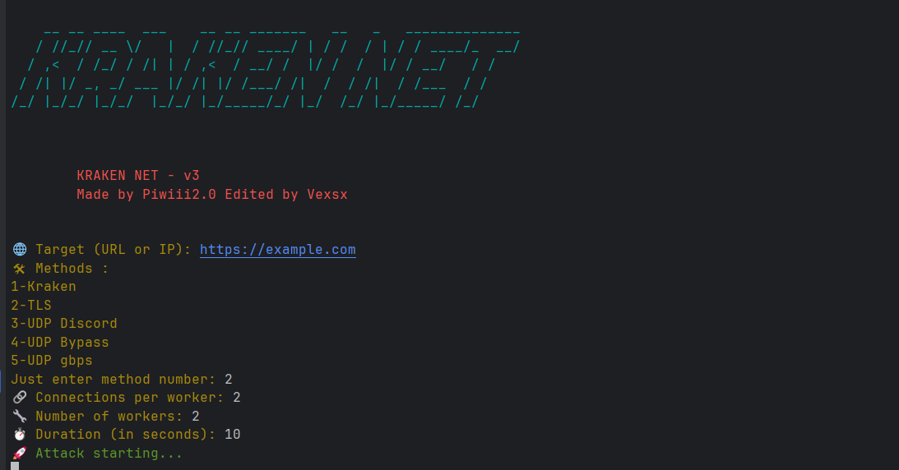

# 🦑 KrakenNet - Web Killer v3

KrakenNet is a high-performance L7 and L4 DoS tool. It simulates random user traffic using rotating User-Agents, random HTTP methods, and dynamic paths. Optional proxy support is included to help bypass basic DDoS protections.

Currently it's the only real DoS tool on github, i mean it is the only one who can really take down websites.

Tested on Ubuntu and Termux.. Should work on all the plateforms.

> ⚠️ **Disclaimer**: This tool is for **educational and authorized testing purposes only**. Unauthorized use against systems you don't own or have explicit permission to test is **illegal**.

> Never target .gov, .mil or .edu websites.

## 🚀 Features

### for kraken method (the one i created)
- Random path generation and method rotation (GET, POST, HEAD)
- Dynamic User-Agent switching
- Optional HTTP proxy support via `http.txt` (You can replace it by your proxies file if you want)
- Cloudflare bypass mode
- Live statistics during and after attack (success, fail, RPS, server status)
- Detection of server downtime (HTTP 500/502/503/504)

### other methods

- TLS (hight request per sec http/2 flood using TLS queries)
- udp-discord (static data flood targeting discord VoIP servers with Dynamic RTC payload)
- udp-bypass (randomized udp data + small packets)
- udp-gbps (optimised udp attack for gbps)
  
## Future features

  - Game methods (FiveM, minecraft, roblox)
  - Adding raw methods
 
## LOOKS




## 🔧 Installation

### Linux / Termux
You must have Go v1.25.0 then
```bash
git clone https://github.com/vexsx/KrakenNet.git
cd KrakenNet
go run main.go
```
# Created by Lemophile & Vexsx
**Discord : Piwiii2.0**
**Telegram: @vexsx**

Don't hesitate to do suggestions and drop a star, it will motivate me !
